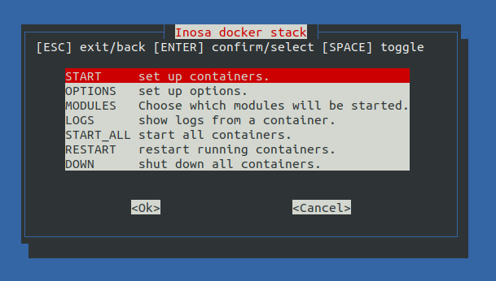
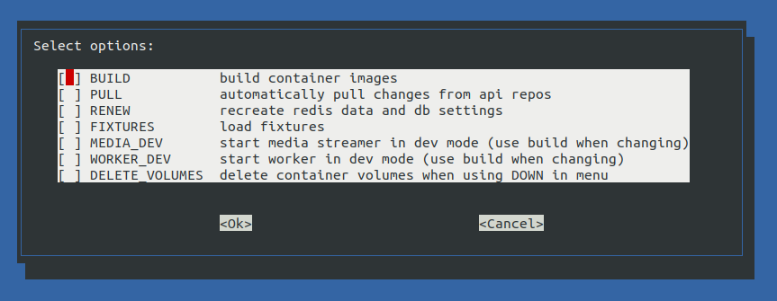
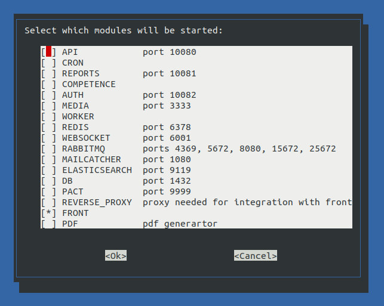
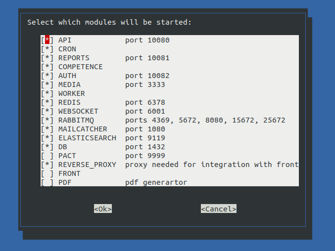

# Inosa
## Before you start
#### Configure environment variables
Run initial script with command  `./init.sh` to configure variables necessary to run Inosa.
#### Add virtual host

##### Windows

Run notepad as administrator and open `C:\Windows\System32\Drivers\etc\hosts`.
Then add the following lines:
```
127.0.0.1 inosa.local
127.0.0.1 api.inosa.local
127.0.0.1 ws.inosa.local
127.0.0.1 reports.inosa.local
127.0.0.1 auth.inosa.local
127.0.0.1 media.inosa.local
```
If you are using docker toolbox, replace 127.0.0.1 with proper docker ip.

##### Linux

Run `sudo vim /etc/hosts` and add the following line:
```127.0.0.1 inosa.local api.inosa.local ws.inosa.local reports.inosa.local media.inosa.local auth.inosa.local```  


## Running script

script `compose.sh` supports two modes:

- graphical interface - run script without any flags `./compose.sh`
- console mode - to activate it the first flag must be '-c', which stands for console mode `./compose.sh -c <additional flags>`

## Graphical interface
### Main menu
Right after running script you will see main menu: 


Usage:
- START - start containers chosen in MODULES and with options chosen in OPTIONS
- OPTIONS - proceed to options
- MODULES - proceed to modules
- LOGS - show logs from chosen container
- START_ALL - start ALL containers present in MODULES (on and off)
- RESTART - restart ALL running containers
- DOWN - shut down ALL running containers
### Options

- BUILD - will build all chosen containers
- PULL - pull changes from api repos
- RENEW - recreate chosen containers (resets environment variables and data)
- FIXTURES - propagate database with example values
- MEDIA_DEV - start media streamer in development mode
- WORKER_DEV - start worker in development mode
- DELETE_VOLUMES -  also delete container volumes when using DOWN in main menu
### Modules
Choose which containers will run

### Example usages
#### Backend developer
Recommended to use START_ALL with options RENEW, FIXTURES
#### Frontend developer
Change in `.env` file:
```
ANGULAR_URL=http://localhost:4201
```
Choose those modules with options RENEW, FIXTURES

Then in your front-end repository run `init.sh` and `npm start`
#### Other
Recommended to use START_ALL with options RENEW, FIXTURES
## Console interface
Show usage with `compose.sh -h|--help`
```
Inosa build script

To run script in interactive mode, run compose.sh without any flag

Parameters:
-c                      - run script in interfaceless mode (needs to be the first argument)
--service=              - select one of available services
--build    [short (-b)] - build containers
--renew    [short (-r)] - recreating redis data and database settings
--fixtures [short (-f)] - load fixtures
--front                 - run front
--reverse-proxy         - proxy for intergrating front with backend
```
Example usage:
```
compose.sh -c -r -b -f
```

## FAQ
##### I'm encountering this error
```
Error response from daemon: could not find an available, non-overlapping IPv4 address pool among the defaults to assign to the network
```
Disconnect from VPN. Run this script. Then you can connect again to VPN.
##### I want to reload environment variables in one container. How do I do it?
Choose only one module and START script with option RENEW. This will refresh all environment variables in container.
##### I'm stuck on the loading screen
This happens when database has no records. Run script again with option FIXTURES.


